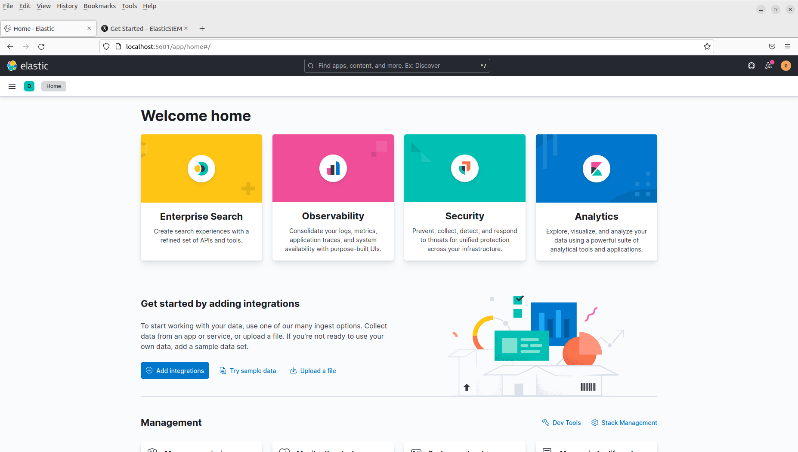
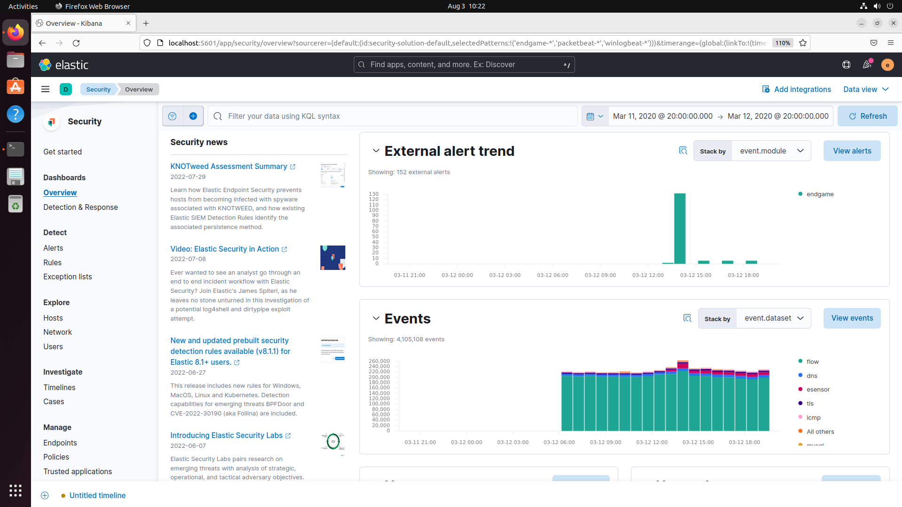
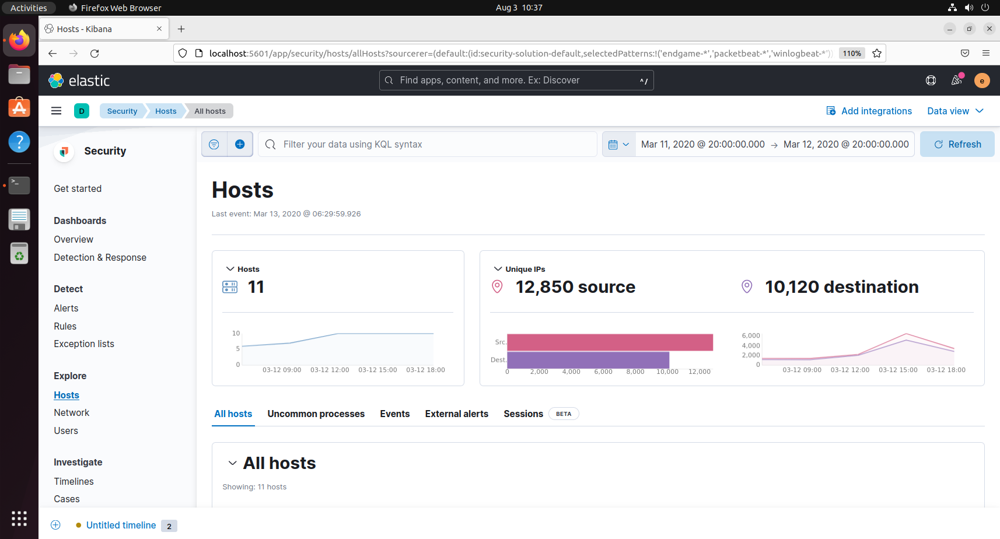
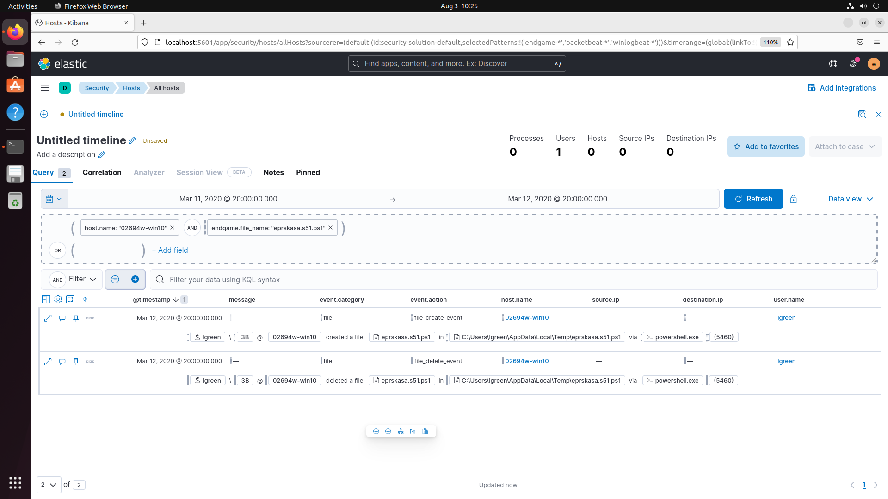

import Bleed from 'nextra-theme-docs/bleed'

# Explore and Understand Overview Tab

1. Navigate to Elastic Security app by clicking on the side navigation menu and scrolling down to the Security section and clicking on **Overview**.

<Bleed></Bleed>

2. We have populated this instance with some honeypot data for your to explore the app. However, the data is historical. Please use the time filter on the top right to set the timeframe to Mar 11, 2020 @ 20:00:00.0 → Mar 12, 2020 @ 20:00:00.0.

<Bleed></Bleed>

3. Take some time to get familiar with the contents of this tab. Explore both the host and network events sections. Explore and understand UI controls in Hosts tab

4. Navigate to the **Hosts** tab and explore visualizations. Visualizations with a time axis are interactive. Click and drag on portion of the time period to zone in. Observe the time filter on top changing accordingly.

<Bleed></Bleed>

5. You can reset the time filter to 2020 @ 20:00:00.0 → Mar 12, 2020 @ 20:00:00.0 by picking it from under recently used date ranges section of the time filter.

6. Scroll down to the “All hosts” table and clicking add to timeline on one hostname.

7. Expand the timeline and notice the newly added filter in the drop area. Try adding more criteria on to the drop zone both right next (horizontally) to the existing filter and below to combine them with and AND or OR logic.

<Bleed></Bleed>

8. Collapse the existing timeline by clicking on the X

9. Move over to the “Authentications” subtab and inside the “Authentications count” chart, filter out “authentication_failure” by hovering over the legend and clicking on "Filter out value" button. This should populate counts for “authentication_success” alone.

10. Scroll up to the top and notice the new filter that has the label "Not event.outcome: failure" Now click the filter and click on "Include results". This should invert the filter and show counts for “authentication_failure” alone.

11. Click back on the Hosts tab and delete the filter with the label "Not event.outcome: failure". Let’s now explore the “Uncommon processes” subtab. The functionalities offered by individual elements are pretty much the same.

12. Finally click on the “Events” tab. The histogram works similar to the one found in the authentications tab. You can use the crosshair to zone in on a timeframe and click on the legends to filter out categories.
